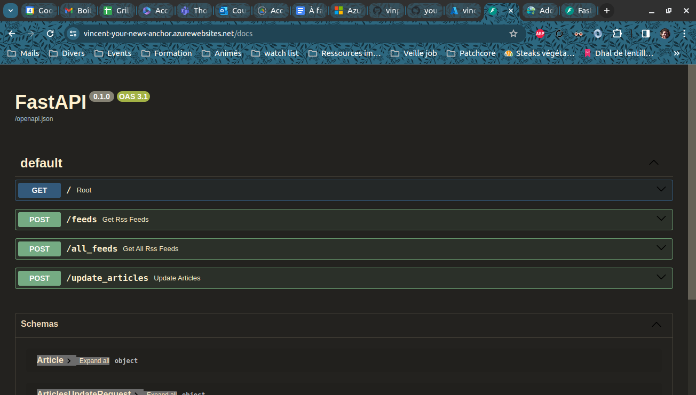

# your_news_anchor_db_api
Ce dépôt contient l'API qui permet d'accéder à la base de données PostgreSQL utilisée pour stocker les données nécessaires au fonctionnement du projet 'Your News Anchor'.

Trois points de terminaison sont disponibles :
- /feeds : permet de récupérer la liste des flux RSS disponibles pour un utilisateur dont le nom est envoyé avec la requête
- /all_feeds : permet de récupérer la liste de tous les flux RSS enregistrés dans l'application (tous utilisateurs confondus)
- /update_articles : remplace tous les articles d'information enregistrés dans la base de données par une nouvelle liste d'articles envoyée avec la requête.

L'API est actuellement déployée sur Microsoft Azure et disponible ici : https://vincent-your-news-anchor.azurewebsites.net/docs.

## Lancer l'API localement
Le script **app.py** permet d'exécuter l'API. Voici comment tester l'API localement :
1) Installer les dépendances :
```
pip install pipenv
pipenv install
```
2) Paramétrer l'accès à la base de données. La base de données à utiliser doit être définie dans le fichier config.yml. Par défaut, l'API utilise une base de données PostgreSQL déployée sur Azure :
```
# Contenu du fichier config.yml par défaut
database_url: "vincent-your-news-anchor-db.postgres.database.azure.com" # URL to the database that contains the data
database_port: "5432" # Port number used for the connection
database_name: "your_news_anchor"
database_user: "vincent"
```
3) Spécifier le mot de passe de la base de données et la clé de sécurité à utiliser pour l'API. Le mot de passe de la base de données n'est pas stocké en clair et doit être défini dans une variable d'environnement. Il est également nécessaire de choisir une clé de sécurité pour l'API. Cette clé devra être jointe à toutes les requêtes envoyées à l'API :
```
export API_TOKEN=<choisissez une clé de sécurité pour l'API>
export DB_PWD=<entrez le mot de passe de la base de données spécifiée dans config.yml>
```
4) Exécuter **app.py** pour lancer l'API :
```
pipenv run uvicorn app:app --reload
```
L'API est ensuite prête à traiter des requêtes.

## Tester l'API
Vous pouvez tester les différents points de terminaison de l'API en vous rendant sur https://vincent-your-news-anchor.azurewebsites.net/docs (si l'API est déployée sur Azure) ou http://127.0.0.1:8000/docs (si l'API est exécutée localement).



## Changer de base de données
Par défaut, cette API utilise une base de données PostgreSQL hébergée sur Azure. Il est possible de créer sa propre base de données en suivant ces deux étapes :
1) Sur un serveur PostgreSQL, exécuter le contenu du script 'create_db.sql'
2) Modifier le contenu du fichier config.yml en conséquence pour indiquer la nouvelle adresse de l'hôte, le nouveau port de connexion, etc...


